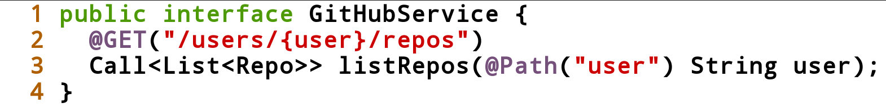
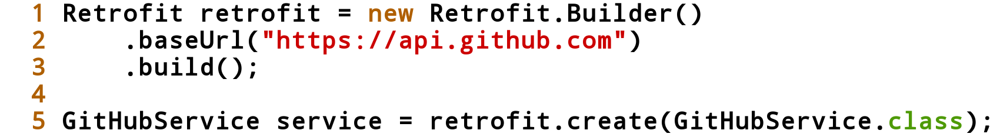
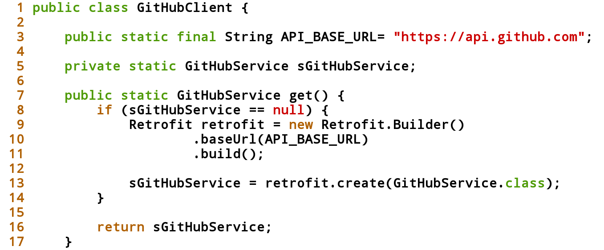
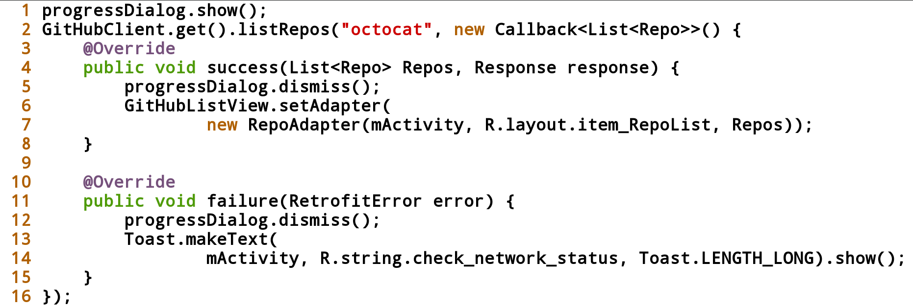
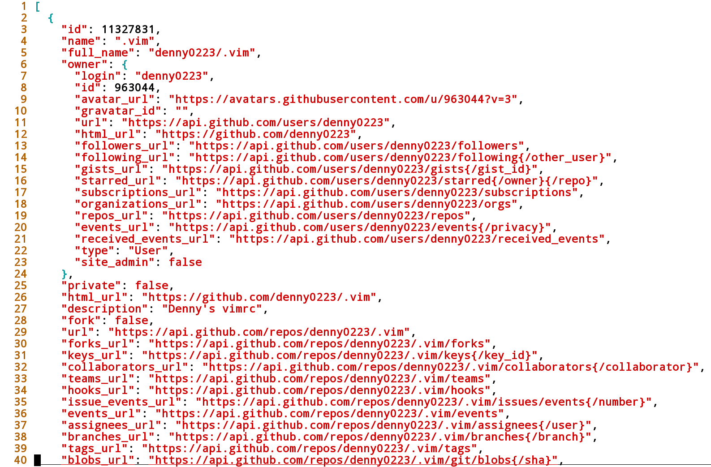
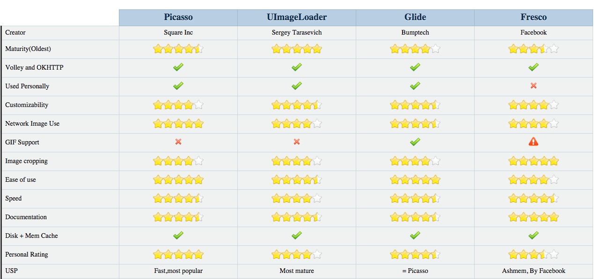

title: Android develop with open source library
output: index.html

--

<h1 style="font-size: 68px">
    從 0 到 1 
    打開 Android 開發的秘密 
    發現開源好棒棒
</h1>
 

## Denny Huang
## 25 Dec, 2015

--

### Denny Huang

* Fanily 粉絲玩樂

* 8tory

* SITCON

* http://denny.one

--

# Survey

--

# IDE
## Eclipse / Android Studio

--

### Eclipse
[Vrapper](https://github.com/vrapper/vrapper)

### Android Studio
[IdeaVim](https://github.com/JetBrains/ideavim)

--

# Build Tools
## Ant / Maven / Gradle

--

<h1 style="font-size: 60px">
  Package manager
  Dependency manager
</h1>
## git submodule / repo / build tool

--

# Library

--

<h1 style="font-size: 60px">
  <a href="http://www.appbrain.com/stats/libraries">
    AppBrain 
    Android library statistics
  </a>
</h1>

--

# HTTP Client

--

# [Android 6.0 Changes](https://developer.android.com/about/versions/marshmallow/android-6.0-changes.html)
## **Apache HTTP Client Removal**

--

# [OkHttp](http://square.github.io/okhttp/)
An HTTP+SPDY client for Android and Java applications

--

# [Retrofit](http://square.github.io/retrofit/)
## Type-safe HTTP client for Android and Java
## by Square, Inc

--

 

  

 

  

 

  

--

  

 

  

--

 

  

--

# Data serialization libraries
## [Google gson](https://github.com/google/gson) / [FasterXML Jackson](http://wiki.fasterxml.com/JacksonHome)

--

  

--

# [jsonschema2pojo](http://www.jsonschema2pojo.org/)
## Generate Plain Old Java Objects
## from JSON or JSON-Schema.

--

# Demo

--

# Image Loaders
## [Picasso](http://square.github.io/picasso/) / [Universal Image Loader](https://github.com/nostra13/Android-Universal-Image-Loader) / [fresco](http://frescolib.org/) / [Glide](https://github.com/bumptech/glide)

--

### Compare

  

    <a href="http://stackoverflow.com/a/29677374/1550306">ref</a>

--

# UI libraries

--

<h1 style="font-size: 64px">
  <a href="https://play.google.com/store/apps/details?id=com.desarrollodroide.repos">
    Libraries for developers
  </a>
</h1>

--

<h1 style="font-size: 48px">
  <a href="http://android-developers.blogspot.tw/2015/05/android-design-support-library.html">
    Android Design Support Library
  </a>
</h1>

--

# [Guide](https://github.com/codepath/android_guides/wiki/Design-Support-Library)
## [Cheesesquare Sample](https://github.com/chrisbanes/cheesesquare) / [AndroidDesignSupportSample](https://github.com/liuguangqiang/AndroidDesignSupportSample)

--

# [Card Library](https://github.com/gabrielemariotti/cardslib)

--

# [CircularImageView](https://github.com/Pkmmte/CircularImageView)

--

# [LoopingViewPager](https://github.com/imbryk/LoopingViewPager)

--

# [Sliding Up Panel](https://github.com/umano/AndroidSlidingUpPanel)

--

# [Draggable Panel](https://github.com/pedrovgs/DraggablePanel)

--

# [PhotoView](https://github.com/chrisbanes/PhotoView)

--

# [ViewPagerIndicator](https://github.com/JakeWharton/ViewPagerIndicator)

--

# [WizarDroid](https://github.com/Nimrodda/WizarDroid)

--

# [WizarDroid with Incdicator](https://github.com/denny0223/WizarDroid)

--

# Analytics
## [Flurry Analytics](http://www.flurry.com/) / [Google Analytics](https://developers.google.com/analytics/devguides/collection/android/)

--

# Crash Reporting
## [ACRA](https://github.com/ACRA/acra)
## [ACRA-backend-route](https://github.com/denny0223/ACRA-backend-route)

--

# Social
## [Simple Facebook](https://github.com/sromku/android-simple-facebook)

--

# Parse
## [Panagram](https://github.com/denny0223/Panagram)

--

# Open Source

--

# License

--

# SITCON 2016
## http://sitcon.org
 
## 2/27 中研院 人文社會科學館
## [Call For Paper](http://sitcon.org/2016/cfp/)

--

# Q & A

--

<h1 style="font-size: 72px">
  Thanks for listening!
</h1>

   

  

<h2 style="font-size: 18px">
本投影片採用<a href="http://creativecommons.org/licenses/by-sa/3.0/tw/" target="_blank">創用 CC「姓名標示—相同方式分享 3.0 台灣」授權條款</a>
</h2>

